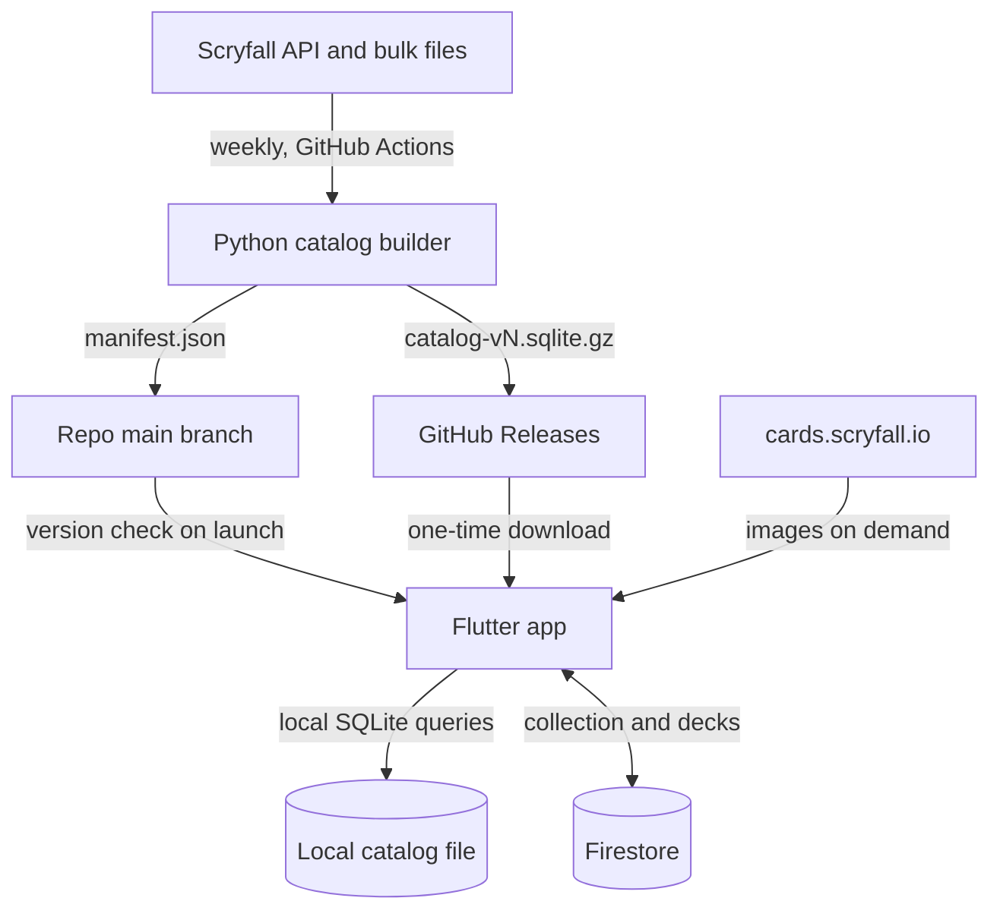
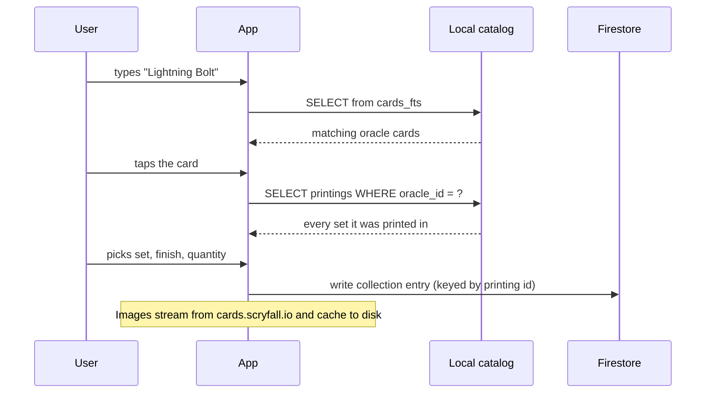

# 01 — Architecture

## 1. System diagram



## 2. The three data stores

Understanding which data lives where is the single most important thing about this project.

| Store | Contents | Size | Written by | Read by |
|---|---|---|---|---|
| **Catalog** (local SQLite) | Every Magic card and printing, every set | ~40–60 MB on disk | Builder only, offline | App, read-only |
| **Firestore** | The user's owned cards and decks | A few hundred KB | App | App |
| **Image cache** (local files) | JPEGs fetched from Scryfall's CDN | Grows with use | App | App |

The catalog is **immutable at runtime**. The app opens it read-only and replaces the whole file
when a new version is published. This means no migration logic in the app — a catalog upgrade is
just a file swap.

## 3. Why no backend server

A server would have to be always-on to be useful, and free always-on hosting either sleeps
(Render, Fly.io free tiers) or does not exist. Everything a server would do is handled elsewhere:

- **Heavy data processing** → the scheduled builder, which runs on GitHub's runners for free.
- **Auth** → Firebase Auth.
- **Authorization** → Firestore security rules.
- **Serving card data** → the local catalog file.
- **Serving images** → Scryfall's own CDN, which is explicitly unmetered.

## 4. Catalog distribution

The builder publishes two artifacts:

1. `catalog-v{N}.sqlite.gz` — a **GitHub Release asset**. Chosen over Firebase Storage because
   GitHub Releases has unlimited free egress and built-in versioning, while new Firebase projects
   require the paid Blaze plan to provision a Cloud Storage bucket at all.
2. `manifest.json` — committed to the repository's default branch and served over
   `raw.githubusercontent.com`. It is a few hundred bytes and is the only network call the app
   makes on a normal launch.

```json
{
  "catalog_version": 7,
  "schema_version": 1,
  "url": "https://github.com/<owner>/<repo>/releases/download/catalog-v7/catalog-v7.sqlite.gz",
  "compressed_size": 18234112,
  "sha256": "…",
  "built_at": "2026-08-18T03:14:00Z",
  "scryfall_bulk_updated_at": "2026-08-18T02:11:04Z",
  "card_count": 31402,
  "printing_count": 112877,
  "set_count": 1043
}
```

The app compares `manifest.json`'s `catalog_version` to the version recorded in its local catalog's
`meta` table. If the manifest is newer **and** its `schema_version` is one the app understands, it
offers an update. If `schema_version` is higher than the app supports, the app keeps using its
current catalog and prompts the user to update the app — it must never download a catalog it
cannot read.

## 5. Update triggers

The builder runs on a **weekly cron** plus a manual `workflow_dispatch` button. It does not run on
app launch.

The app cannot rebuild the catalog — that needs a 74 MB download and a full transform. Having the
app trigger the workflow remotely would require embedding a GitHub token in a distributed client,
which is an unacceptable credential leak. **Never do this.**

Since Magic sets release roughly every two months, a weekly rebuild always picks up a new set
within seven days. The manual button covers release day.

## 6. Client platform split

One Flutter codebase targets Android and Windows. Platform differences are isolated to two places:

1. **SQLite bindings** — `sqlite3_flutter_libs` bundles the native library on Android; Windows
   needs the DLL placed alongside the executable. Handled once in the data layer.
2. **Firebase** — official Firebase support on Windows is beta and Google's own docs state it is
   "not intended for production use cases, only local development workflows." Therefore all
   Firestore and Auth access goes through the repository interfaces in
   `04-firestore-model.md` §6, so a REST-based implementation can be substituted on Windows
   without touching UI code.

## 7. Data flow: adding a card to the collection

This is the flow that most justifies the architecture. It involves **zero** network calls.



Had the catalog stored only oracle-level cards, the printings list would have required a live
`/cards/search` call per card at 2 requests/second — turning a 300-card box into minutes of
waiting, and breaking entirely offline.

## 8. Identifiers

| Identifier | Scope | Used for |
|---|---|---|
| `oracle_id` (UUID) | Stable across all reprints | Grouping printings; deck lists; "do I own this card in any set" |
| `scryfall_id` (UUID) | One specific printing | Collection entries; image URLs |
| `set.code` (3–6 chars) | One set | Display, grouping, filters |

Collection entries key on **`scryfall_id`** because owning a specific printing is the point of a
collection. They also denormalize `oracle_id` so deck-building can ask "do I own this card at all"
without a join.

Scryfall occasionally merges or deletes printing IDs. The catalog carries a `migrations` table so
the app can repair collection entries after an update — see `02-catalog-schema.md` §4.
