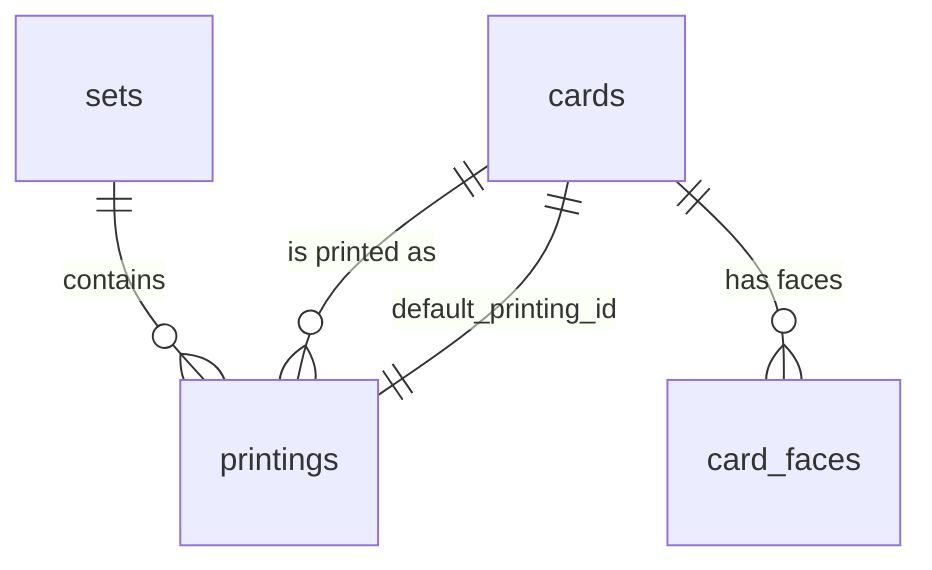

# 02 — Catalog SQLite Schema

**This file is the contract between the Python builder (`03-catalog-builder.md`) and the Flutter
app (`05-flutter-app.md`).** Both sides must be written against it. Any change here is a breaking
change and must bump `schema_version`.

Current `schema_version`: **1**

---

## 1. Design rules

1. **Oracle data and printing data are separate tables.** `cards` holds the ~31k unique cards with
   their rules text. `printings` holds the ~113k physical printings, and is deliberately *slim* —
   no rules text, no image URLs, no prices. This keeps the file small while still allowing an
   instant, offline set picker.
2. **No image URLs are stored.** They are derived from `scryfall_id` at runtime — see §5.
3. **No prices.** They go stale within 24 hours and would force daily rebuilds.
4. **Booleans are stored as `INTEGER` 0/1.** SQLite has no boolean type.
5. **Repeated string lists are stored as JSON arrays in `TEXT` columns** (e.g. `colors`,
   `keywords`). They are for display and filtering, not joining. Filter them with `LIKE '%"R"%'`
   or parse in Dart.
6. **The file is opened read-only by the app.** No triggers, no writable views.

## 2. Tables

### `meta`

Key/value header. Read this first; the app uses it to decide whether its catalog is current.

```sql
CREATE TABLE meta (
    key   TEXT PRIMARY KEY,
    value TEXT NOT NULL
);
```

| Key | Example | Meaning |
|---|---|---|
| `schema_version` | `1` | Must match what the app supports |
| `catalog_version` | `7` | Monotonic build counter, matches `manifest.json` |
| `built_at` | `2026-08-18T03:14:00Z` | When the builder ran |
| `scryfall_bulk_updated_at` | `2026-08-18T02:11:04Z` | `updated_at` of the source bulk file |
| `source_bulk_type` | `default_cards` | Which bulk dataset was used |
| `card_count` | `31402` | Row count of `cards` |
| `printing_count` | `112877` | Row count of `printings` |
| `set_count` | `1043` | Row count of `sets` |

### `sets`

```sql
CREATE TABLE sets (
    code             TEXT PRIMARY KEY,   -- 3-6 char set code, lowercase
    scryfall_id      TEXT NOT NULL,      -- UUID
    name             TEXT NOT NULL,
    set_type         TEXT NOT NULL,      -- core, expansion, masters, commander, token, promo, …
    released_at      TEXT,               -- ISO date 'YYYY-MM-DD', nullable for unreleased sets
    card_count       INTEGER NOT NULL,
    parent_set_code  TEXT,               -- for promo/token sets attached to a parent
    block_code       TEXT,
    block            TEXT,
    digital          INTEGER NOT NULL,   -- 0/1, Arena/MTGO-only sets
    foil_only        INTEGER NOT NULL,   -- 0/1
    nonfoil_only     INTEGER NOT NULL,   -- 0/1
    icon_svg_uri     TEXT
);
CREATE INDEX idx_sets_released ON sets (released_at DESC);
CREATE INDEX idx_sets_type     ON sets (set_type);
```

`icon_svg_uri` is stored as a URL, not as blob data. Scryfall asks that icons be cached rather than
hotlinked, so the app should download and cache each icon on first use.

### `cards`

One row per unique Magic card, keyed by `oracle_id`. This is where the rules text lives.

```sql
CREATE TABLE cards (
    oracle_id            TEXT PRIMARY KEY,
    name                 TEXT NOT NULL,
    mana_cost            TEXT,           -- '{1}{U}{U}', empty for lands, NULL for multi-face
    cmc                  REAL NOT NULL,
    type_line            TEXT,
    oracle_text          TEXT,
    power                TEXT,           -- TEXT: values like '*', '1+*' exist
    toughness            TEXT,
    loyalty              TEXT,
    defense              TEXT,
    colors               TEXT,           -- JSON array, e.g. '["U","R"]'
    color_identity       TEXT NOT NULL,  -- JSON array
    keywords             TEXT,           -- JSON array, e.g. '["Flying","Haste"]'
    produced_mana        TEXT,           -- JSON array
    layout               TEXT NOT NULL,  -- normal, split, flip, transform, modal_dfc, meld, …
    legalities           TEXT NOT NULL,  -- JSON object: {"standard":"not_legal","commander":"legal",…}
    reserved             INTEGER NOT NULL, -- 0/1, Reserved List
    game_changer         INTEGER NOT NULL, -- 0/1, Commander Game Changer list
    edhrec_rank          INTEGER,
    face_count           INTEGER NOT NULL, -- 0 if single-faced; else number of card_faces rows
    default_printing_id  TEXT NOT NULL     -- FK -> printings.scryfall_id, the printing to show by default
);
CREATE INDEX idx_cards_name     ON cards (name COLLATE NOCASE);
CREATE INDEX idx_cards_cmc      ON cards (cmc);
CREATE INDEX idx_cards_edhrec   ON cards (edhrec_rank);
```

**`default_printing_id` selection rule** (applied by the builder, in order):

1. Prefer `image_status` of `highres_scan`, then `lowres`, then anything else.
2. Prefer non-promo, non-variation, non-digital, non-oversized printings.
3. Prefer a set of type `core` or `expansion`.
4. Break ties by most recent `released_at`, then lowest `collector_number`.

### `card_faces`

Only populated for multi-faced cards (`layout` in `split`, `flip`, `transform`, `modal_dfc`,
`meld`, `adventure`, `reversible_card`). Single-faced cards have **no rows here** and
`cards.face_count = 0`.

```sql
CREATE TABLE card_faces (
    oracle_id    TEXT NOT NULL,
    face_index   INTEGER NOT NULL,   -- 0-based, matches Scryfall's card_faces array order
    name         TEXT NOT NULL,
    mana_cost    TEXT,
    type_line    TEXT,
    oracle_text  TEXT,
    power        TEXT,
    toughness    TEXT,
    loyalty      TEXT,
    defense      TEXT,
    colors       TEXT,               -- JSON array
    has_image    INTEGER NOT NULL,   -- 0/1, whether this face has its own image (see §5)
    PRIMARY KEY (oracle_id, face_index)
);
```

### `printings`

One row per physical printing. **Slim by design** — this table has ~113k rows, so every column
costs about 110 KB of file size.

```sql
CREATE TABLE printings (
    scryfall_id       TEXT PRIMARY KEY,
    oracle_id         TEXT NOT NULL,
    set_code          TEXT NOT NULL,
    collector_number  TEXT NOT NULL,   -- TEXT: values like '12a', '★123' exist
    rarity            TEXT NOT NULL,   -- common, uncommon, rare, special, mythic, bonus
    finishes          TEXT NOT NULL,   -- JSON array, subset of ["nonfoil","foil","etched"]
    lang              TEXT NOT NULL,   -- almost always 'en' in the default_cards dataset
    artist            TEXT,
    released_at       TEXT,            -- ISO date
    image_status      TEXT NOT NULL,   -- missing, placeholder, lowres, highres_scan
    border_color      TEXT,
    frame             TEXT,
    promo             INTEGER NOT NULL,  -- 0/1
    full_art          INTEGER NOT NULL,  -- 0/1
    textless          INTEGER NOT NULL,  -- 0/1
    variation         INTEGER NOT NULL,  -- 0/1
    oversized         INTEGER NOT NULL,  -- 0/1
    digital           INTEGER NOT NULL,  -- 0/1
    booster           INTEGER NOT NULL,  -- 0/1
    two_sided_image   INTEGER NOT NULL   -- 0/1, whether a /back/ image exists (see §5)
);
CREATE INDEX idx_printings_oracle ON printings (oracle_id);
CREATE INDEX idx_printings_set    ON printings (set_code, collector_number);
CREATE INDEX idx_printings_rarity ON printings (rarity);
CREATE INDEX idx_printings_artist ON printings (artist COLLATE NOCASE);
```

Foreign keys to `cards.oracle_id` and `sets.code` are **not declared** as SQL constraints, to keep
inserts fast and avoid ordering requirements during the build. The builder validates referential
integrity explicitly instead (see `03-catalog-builder.md` §6).

### `migrations`

Scryfall's record of printing IDs that were merged into another ID or deleted outright. The app
applies these to collection entries after a catalog update so that owned cards do not silently
point at dead IDs.

```sql
CREATE TABLE migrations (
    id                TEXT PRIMARY KEY,   -- migration UUID
    performed_at      TEXT NOT NULL,      -- ISO date
    strategy          TEXT NOT NULL,      -- 'merge' or 'delete'
    old_scryfall_id   TEXT NOT NULL,
    new_scryfall_id   TEXT,               -- NULL when strategy = 'delete'
    note              TEXT
);
CREATE INDEX idx_migrations_old ON migrations (old_scryfall_id);
```

### `cards_fts`

Full-text search over card names and rules text. Uses FTS5 in **external content** mode so the text
is not duplicated on disk.

```sql
CREATE VIRTUAL TABLE cards_fts USING fts5 (
    name,
    oracle_text,
    type_line,
    content = 'cards',
    content_rowid = 'rowid',
    tokenize = "unicode61 remove_diacritics 2"
);
```

Because `cards` uses a `TEXT` primary key, its implicit `rowid` is what links to the FTS index. The
builder populates the index after all `cards` rows are inserted with:

```sql
INSERT INTO cards_fts (rowid, name, oracle_text, type_line)
    SELECT rowid, name, oracle_text, type_line FROM cards;
```

Query it by joining back on `rowid`:

```sql
SELECT c.* FROM cards_fts f
JOIN cards c ON c.rowid = f.rowid
WHERE cards_fts MATCH ?
ORDER BY bm25(cards_fts, 10.0, 1.0, 2.0)
LIMIT 50;
```

The `bm25` weights bias matches toward the card **name** over rules text. Note that user input must
be escaped before being passed to `MATCH` — see `05-flutter-app.md` §5.

## 3. Entity relationships



## 4. Applying migrations in the app

After swapping in a new catalog, for every collection entry whose `printingId` appears in
`migrations.old_scryfall_id`:

- `strategy = 'merge'` → rewrite the entry's `printingId` to `new_scryfall_id`. If an entry for the
  target already exists, sum the quantities and delete the duplicate.
- `strategy = 'delete'` → flag the entry as orphaned and surface it to the user for manual
  resolution. **Do not delete the user's data automatically.**

Record the highest `performed_at` already applied in local settings so the work is not repeated.

## 5. Deriving image URLs

**Verified against the live CDN on 2026-08-18** for `normal`, `transform`, and `split` layouts.

```
https://cards.scryfall.io/{size}/{face}/{id[0]}/{id[1]}/{id}.jpg
```

- `{size}` — one of `small`, `normal`, `large`, `png`, `art_crop`, `border_crop`.
  (`png` files use the `.png` extension, not `.jpg`.)
- `{face}` — `front`, or `back` for the reverse of a double-sided printing.
- `{id[0]}`, `{id[1]}` — the first and second characters of `scryfall_id`.
- `{id}` — the full `scryfall_id`.

Example for `7673784e-db4b-43a1-8d55-1bb9fc1e284f`:

```
https://cards.scryfall.io/normal/front/7/6/7673784e-db4b-43a1-8d55-1bb9fc1e284f.jpg
```

Scryfall's own API returns these URLs with a `?<timestamp>` cache-busting suffix. Omitting it
resolves correctly and is preferable here, because a stable URL means the app's disk cache stays
valid across catalog updates.

Guidance:

- Use `small` in list rows, `normal` in card detail, `art_crop` for headers.
- Only request a `back` image when `printings.two_sided_image = 1`.
- Skip image loading entirely when `image_status = 'missing'`; show a placeholder.
- **Never crop out the copyright line or artist name, and never apply your own watermark** — this
  is a condition of Scryfall's image usage terms.

## 6. Actual size

Measured from the first full build (Scryfall `default_cards`, 2026-08-17 snapshot). The builder
uses these as regression bounds — see `03-catalog-builder.md` §6.

| Table | Rows |
|---|---|
| `cards` | 38,626 |
| `printings` | 116,712 |
| `card_faces` | 6,451 |
| `sets` | 1,047 |
| `migrations` | 2,569 |
| **Total after VACUUM** | **79.7 MB** |
| **Gzipped (what ships)** | **24.8 MB** |

If a build produces row counts or a compressed size outside the bounds in
`03-catalog-builder.md` §6, the builder fails loudly rather than publishing it.
