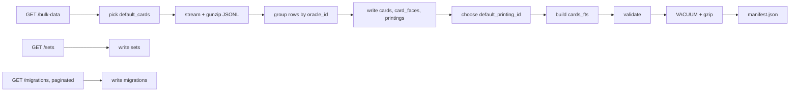

# 03 — Catalog Builder

**Location:** `tools/catalog_builder/build_catalog.py`
**Language:** Python 3.9+ (CI runs 3.12), **standard library only**

Reads Scryfall bulk data, writes the SQLite catalog described in `02-catalog-schema.md`, and emits
`manifest.json`.

---

## 1. Why Python, stdlib only

This is a batch ETL job: stream a gzip stream, parse JSON lines, insert rows. `gzip`, `json`, and
`sqlite3` are all in the standard library, so there is no `requirements.txt`, no lockfile, and no
dependency-install step in CI. The whole build is `python build_catalog.py`.

Performance is a non-issue — ~113k lines parsed and ~150k rows inserted inside a single transaction
completes in well under a minute, and this runs once a week.

## 2. Prerequisite check

The bundled SQLite must have **FTS5** compiled in. Assert this at startup and fail immediately with
a clear message rather than crashing later:

```python
opts = {row[0] for row in conn.execute("PRAGMA compile_options")}
if "ENABLE_FTS5" not in opts:
    raise SystemExit(
        "This Python's sqlite3 lacks FTS5. Install `pysqlite3-binary` and "
        "import it as sqlite3, or use a different Python build."
    )
```

*Verified present in CPython 3.9.13 on Windows (SQLite 3.37.2) and on GitHub's `ubuntu-latest`
runners.*

## 3. HTTP rules

Every request to `api.scryfall.com` **must** send:

```
User-Agent: MTGCollectionTracker/1.0
Accept: */*
```

Scryfall rejects default library user-agents. Rate limits: 10 requests/second for `/bulk-data`,
`/sets`, and `/migrations`; the builder makes only a handful of calls, but it should still sleep
100 ms between them. Downloads from `data.scryfall.io` are unmetered and need no throttling.

## 4. Pipeline



### Step 1 — Locate the bulk file

`GET https://api.scryfall.com/bulk-data`, find the entry with `type == "default_cards"`, and take
its `jsonl_download_uri` and `updated_at`.

`default_cards` is the right dataset: every printing, English only (or the sole available language),
~74 MB. `all_cards` (~374 MB) adds every foreign-language printing, which v1 does not use.
`oracle_cards` lacks printings entirely.

### Step 2 — Stream, do not buffer

The decompressed file is ~500 MB. It must never be fully materialised in memory:

```python
req = urllib.request.Request(url, headers=HEADERS)
with urllib.request.urlopen(req) as resp:
    with gzip.GzipFile(fileobj=resp) as gz:
        for raw in gz:                 # one JSON object per line
            card = json.loads(raw)
            ...
```

Wrapping the raw HTTP response in `GzipFile` decompresses on the fly, and iterating the file object
yields one line at a time. Never call `.read()` without a size, and never `json.loads` the whole
payload.

### Step 3 — Group by oracle card

The bulk file is a flat list of printings. As each row streams in:

- Resolve its oracle key (see §5.1). Every row becomes a `printings` insert.
- The **first** time an oracle key is seen, buffer its oracle-level fields for the `cards` insert
  and, if multi-faced, its `card_faces` rows.
- Track the best-so-far `default_printing_id` candidate per oracle key using the ranking rule in
  `02-catalog-schema.md` §2. Comparing candidates as they stream avoids holding all printings in
  memory.

Only oracle-level data is retained in memory — roughly 31k small dicts, a few hundred MB at worst
if done carelessly, so insert `printings` rows in batches as they arrive rather than accumulating.

### Step 4 — Batch inserts

Accumulate rows in lists and flush every 5,000 with `executemany`, all inside **one** transaction.
Set these pragmas before inserting:

```sql
PRAGMA journal_mode = OFF;
PRAGMA synchronous  = OFF;
PRAGMA temp_store   = MEMORY;
```

They are safe here because the output is a disposable build artifact — if the build crashes, it is
rerun from scratch. Create indexes and the FTS table **after** the bulk inserts, never before.

### Step 5 — Sets and migrations

`GET /sets` returns a paginated `List`; follow `next_page` until `has_more` is false.
`GET /migrations` behaves the same way. Both are small.

### Step 6 — Finalise

1. Populate `cards_fts` from `cards`.
2. Create all indexes.
3. Write the `meta` rows.
4. `PRAGMA optimize` then `VACUUM`.
5. Validate (§6).
6. Gzip to `catalog-v{N}.sqlite.gz`.
7. Write `manifest.json`.

## 5. Data quirks that will break a naive implementation

These are the specific cases that cause bugs. Handle every one.

### 5.1 Missing `oracle_id`

Cards with `layout == "reversible_card"` have **no top-level `oracle_id`** — it appears on each
entry of `card_faces` instead. Resolve with:

```python
oracle_id = card.get("oracle_id") or card["card_faces"][0].get("oracle_id")
```

If it is still missing, skip the row and count it in a `skipped_no_oracle_id` tally that gets
reported at the end. Do not crash.

### 5.2 Oracle fields living on faces

For `split`, `flip`, `transform`, `modal_dfc`, `adventure`, and `meld` layouts, the top-level
object may have **no** `mana_cost`, `power`, `toughness`, or `oracle_text` — those live per-face.
`cmc`, `color_identity`, `type_line`, and `name` (as `"Front // Back"`) do remain at the top level.
Store what is present at the top level and put the rest in `card_faces`.

### 5.3 `power` / `toughness` are not numbers

Real values include `*`, `1+*`, `∞`, and `?`. The schema uses `TEXT`. Never cast to int.

### 5.4 `collector_number` is not a number

Real values include `12a`, `★123`, `A-45`. `TEXT`, and sort with a natural-sort helper in the app,
not numerically.

### 5.5 Where images live

`image_uris` sits on the top-level object for single-faced cards, but on **each face** for
double-sided layouts (`transform`, `modal_dfc`, `reversible_card`). Split and flip cards are a
single physical card, so their images stay at the top level even though they have faces.

Set `printings.two_sided_image = 1` only when `card_faces[1]` has its own `image_uris`. Set
`card_faces.has_image` per face the same way. The builder does not store any URL — see
`02-catalog-schema.md` §5.

### 5.6 Tokens, emblems, and art cards

`default_cards` includes them. **Keep them** — they are collectable and belong in the catalog. They
are identifiable by `set_type = 'token'` or a `type_line` containing `Token`. The app filters them
out of default search results but must still be able to show them.

### 5.7 Duplicate oracle IDs across languages

Even in `default_cards`, a handful of cards appear in a non-English language when no English
printing exists. The `cards` row should be taken from the first row seen; the `lang` column on
`printings` records the actual language.

### 5.8 Nulls everywhere

Almost every field except `id`, `name`, `set`, and `lang` is optional. Use `card.get(...)`
throughout. Never index a dict directly on an optional field.

## 6. Validation before publishing

The builder must refuse to publish a bad catalog. Fail the build if any of these hold:

| Check | Threshold |
|---|---|
| `cards` row count | outside 20,000–60,000 |
| `printings` row count | outside 80,000–200,000 |
| `sets` row count | outside 700–2,000 |
| Printings with no matching `cards` row | > 0 |
| Printings with no matching `sets` row | > 0 |
| Cards whose `default_printing_id` is missing from `printings` | > 0 |
| Gzipped output size | outside 8–40 MB |
| `cards_fts` row count | != `cards` row count |
| Spot-check of 25 random derived image URLs (HEAD) | any non-200 |

The image spot-check is the only network call in the validation step; throttle it to 5 requests per
second against the CDN.

## 7. CI workflow

`.github/workflows/build-catalog.yml`

- **Triggers:** `schedule` with a weekly cron, plus `workflow_dispatch` for release day.
- **Steps:** checkout → `actions/setup-python@v5` (3.12) → `python tools/catalog_builder/build_catalog.py`
  → upload the `.gz` as a **GitHub Release asset** tagged `catalog-v{N}` → commit the updated
  `manifest.json` back to the default branch.
- **Permissions:** `contents: write` is required for both the release and the manifest commit.
- **Version number:** `catalog_version` is derived from the count of existing `catalog-v*` tags plus
  one, so it stays monotonic without any external state.
- The job should be a no-op when the source bulk file's `updated_at` has not changed since the
  version recorded in the current `manifest.json`, unless `workflow_dispatch` was used with a
  `force` input.

## 8. Local usage

```powershell
python tools/catalog_builder/build_catalog.py --out build/
python tools/catalog_builder/build_catalog.py --out build/ --limit 5000   # fast dev run
```

`--limit` stops after N printings so the pipeline can be exercised in seconds. A catalog built with
`--limit` sets `meta.partial = 1` and must never be published.
