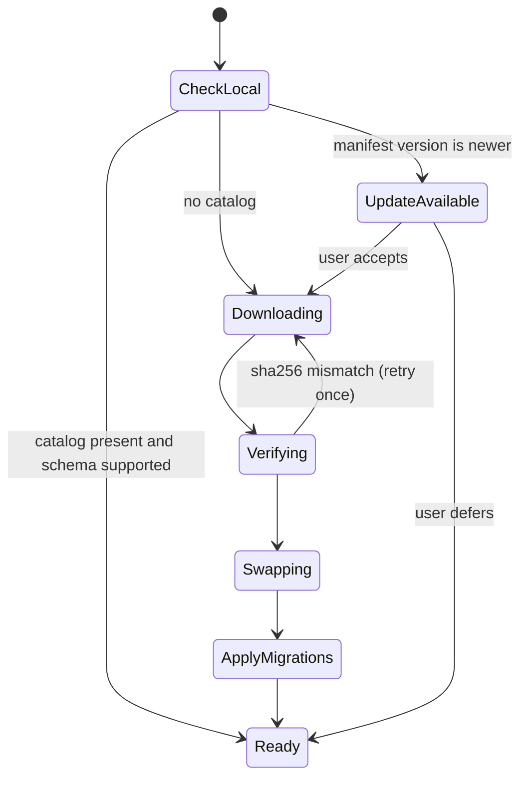

# 05 — Flutter App

**Location:** `app/`
**Targets:** Android and Windows only. Do not enable iOS, macOS, Linux, or web.

---

## 1. Project layout

```
app/lib/
├── main.dart
├── app.dart                      // MaterialApp, routing, theme
├── core/
│   ├── di.dart                   // provider/riverpod wiring, platform selection
│   ├── result.dart
│   └── natural_sort.dart         // collector-number sorting
├── data/
│   ├── catalog/
│   │   ├── catalog_database.dart    // opens the SQLite file read-only
│   │   ├── catalog_bootstrap.dart   // manifest check, download, verify, swap
│   │   ├── card_dao.dart
│   │   ├── printing_dao.dart
│   │   └── set_dao.dart
│   ├── collection/
│   │   ├── collection_repository.dart          // abstract, see 04 §8
│   │   └── firestore_collection_repository.dart
│   ├── decks/
│   │   ├── deck_repository.dart
│   │   └── firestore_deck_repository.dart
│   └── auth/
│       ├── auth_service.dart
│       └── firebase_auth_service.dart
├── models/                       // plain Dart classes, no framework imports
│   ├── mtg_card.dart
│   ├── card_face.dart
│   ├── printing.dart
│   ├── mtg_set.dart
│   ├── collection_entry.dart
│   └── deck.dart
├── features/
│   ├── bootstrap/                // first-run catalog download screen
│   ├── search/
│   ├── card_detail/
│   ├── collection/
│   ├── decks/
│   └── settings/
└── widgets/
    ├── card_image.dart
    ├── mana_cost.dart            // renders {2}{U}{U} as symbols
    └── set_icon.dart
```

Keep `models/` free of `sqflite`, `cloud_firestore`, and `flutter` imports so the same classes work
on both sides of every repository boundary.

## 2. Dependencies

| Package | Purpose |
|---|---|
| `sqlite3` + `sqlite3_flutter_libs` | Native SQLite. Bundles the library on Android; on Windows the DLL is copied next to the .exe automatically. |
| `path_provider` | Locate the app support directory for the catalog file and image cache |
| `http` | Manifest fetch and catalog download |
| `crypto` | SHA-256 verification of the downloaded catalog |
| `archive` **or** `dart:io` `gzip` | Decompress the catalog. Prefer `dart:io`'s built-in `gzip` codec — no dependency. |
| `cached_network_image` | Card images with a disk cache |
| `firebase_core`, `firebase_auth`, `cloud_firestore` | Cloud sync (see the Windows caveat in `04-firestore-model.md` §8) |
| `google_sign_in` | Google auth provider |
| `riverpod` / `flutter_riverpod` | State management and DI |

Use `sqlite3` directly rather than `sqflite`: `sqflite` has no first-class Windows support, while
`sqlite3_flutter_libs` covers both targets with one API. `drift` is a reasonable alternative if a
typed query layer is wanted, but it is optional — the catalog is read-only and the queries are few.

## 3. First-run bootstrap



Rules:

- The catalog lives at `{appSupportDir}/catalog/catalog.sqlite`, with its version in the `meta`
  table — not in the filename.
- Download to `catalog.sqlite.gz.tmp`, decompress to `catalog.sqlite.tmp`, verify the SHA-256 of
  the **compressed** file against the manifest, then atomically rename over the old file. Never
  overwrite a working catalog in place.
- Show real progress. It is an ~18 MB download and the only slow moment in the app's life.
- If `manifest.schema_version > kSupportedSchemaVersion`, do **not** download. Keep the current
  catalog and tell the user to update the app.
- A failed manifest fetch is not an error when a local catalog already exists — log it and carry on
  offline.
- After a successful swap, apply `migrations` to collection entries per `02-catalog-schema.md` §4.

## 4. Opening the catalog

```dart
final db = sqlite3.open(path, mode: OpenMode.readOnly);
db.execute('PRAGMA query_only = ON;');
db.execute('PRAGMA cache_size = -32000;');   // ~32 MB page cache
db.execute('PRAGMA temp_store = MEMORY;');
```

Open once at startup and hold the handle for the app's lifetime. Opening per query is slow and
defeats the page cache.

On Windows, verify `sqlite3.dll` ships next to the executable in release builds — this is the most
common packaging failure.

## 5. Search

Two query paths, chosen by whether the user typed anything:

**Text search** — FTS5, per `02-catalog-schema.md` §2:

```sql
SELECT c.* FROM cards_fts f
JOIN cards c ON c.rowid = f.rowid
WHERE cards_fts MATCH ?
ORDER BY bm25(cards_fts, 10.0, 1.0, 2.0)
LIMIT 50 OFFSET ?;
```

**Filter-only browse** — a plain indexed query against `cards` when the search box is empty but
colour/type/rarity/set filters are active.

**Escaping is mandatory.** FTS5 treats `"`, `*`, `:`, `^`, `-`, `(`, `)`, and `NEAR` as operators.
Raw user input passed to `MATCH` will throw on something as ordinary as `Jace, the Mind Sculptor`.
Wrap each whitespace-separated token in double quotes and double any embedded quotes:

```dart
String toFtsQuery(String input) => input
    .split(RegExp(r'\s+'))
    .where((t) => t.isNotEmpty)
    .map((t) => '"${t.replaceAll('"', '""')}"*')
    .join(' ');
```

Other requirements:

- **Debounce input by ~250 ms** and run queries off the UI isolate for large result sets.
- Default filters hide `set_type = 'token'` and `digital = 1` printings; both are toggleable.
- Paginate with `LIMIT`/`OFFSET`, 50 rows per page.
- Never `SELECT *` on a joined query in a list view — fetch only the columns the row widget renders.

## 6. Card detail

- Header art from `art_crop`, main image from `normal`.
- Faces: for `transform` and `modal_dfc`, a flip button swapping `front`/`back` images. For `split`,
  a rotate affordance — it is one image. For `adventure` and `flip`, show both faces' text under a
  single image.
- Printings list: `SELECT … FROM printings WHERE oracle_id = ? ORDER BY released_at DESC`, grouped
  by set, showing set icon, collector number, rarity, and available finishes.
- An "owned" badge on any printing present in the collection.
- Add-to-collection sheet: set, finish, condition, language, quantity → one repository call.

## 7. Images

Always use the derived URLs from `02-catalog-schema.md` §5.

- `small` in lists, `normal` in detail, `art_crop` for headers.
- `cached_network_image` with an explicit disk cache; set a generous but bounded cache size and a
  long stale period, since the URLs are stable and the images never change.
- Send the `User-Agent: MTGCollectionTracker/1.0` header on image requests too.
- When `image_status = 'missing'`, render a placeholder and skip the request entirely.
- **Never crop out the copyright or artist line, never recolour or blur, never overlay a
  watermark.** These are conditions of Scryfall's image terms, not stylistic preferences.

## 8. Collection screens

- Views: by set, by colour, by name, recently added.
- Each row shows thumbnail, name, set icon, quantity, finish.
- Inline quantity stepper writing straight through the repository.
- Summary header: distinct cards, total cards, sets represented. Deliberately **no value total** —
  prices are out of scope.
- Orphaned entries (from a `delete` migration) surface in a dismissible banner for manual fixing.

## 9. Offline behaviour

| Feature | Offline |
|---|---|
| Search, browse, card detail, printings | Fully works — local SQLite |
| Card images | Works if cached; placeholder otherwise |
| Viewing collection and decks | Works via Firestore local persistence |
| Editing collection and decks | Queues in Firestore's local write buffer and syncs on reconnect |
| Catalog update | Requires network; silently skipped |

## 10. Platform notes

- **Android:** `minSdk 23` (Firebase Auth's floor). Add `INTERNET` permission. Sign release builds
  with a local keystore that is **gitignored and never committed**.
- **Windows:** ship `sqlite3.dll` alongside the executable. Firebase support is beta — see
  `04-firestore-model.md` §8 before writing any Firebase code.
- Use `defaultTargetPlatform` for platform branching, never `dart:io` `Platform` checks inside
  widgets.
